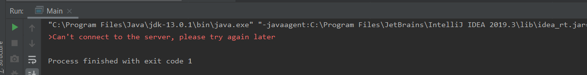

# Introduction  
This is a CLI operated file server. Once installed and run, 
with this server you will have a public location where other users can PUSH - GET - DELETE - LIST - SYNCH their files to, 
using 1 or more FileClients connecting to the FileServer using CLI commands.   

# Installation
To install this Application clone the following link: 
https://github.com/crimsonfyza/AFTP_FileClient.git

To setup the application for the "first use" read #How to use

# How to use 
Before running FileClient make sure the FileServer is running, FileClient will use port: "25444" and the IP address from the FileServer, make sure both the port and address are available.
If you get the error ">Can't connect to the server, please try again later" the server could not be reached, check the port and IP address.

   

if the error above doesn't happen the FileClient is connected.
Then you will have the following 5 commands available:
- PUT: Running PUT filename.txt will upload the file to the FileServer, if 2 Clients PUT the same file or the File is in use on the FileServers end, the application throws an 423 Locked error and the action will not continue.
- GET: Running GET filename.txt will download the file from the FileServer, this will never fail unless the FileServer is unavailable since even a locked file can be downloaded because it is a read only action.
- DELETE: Running DELETE filename.txt will delete the file from the FileServer, if the file is locked or in use DELETE will not be able to remove it, error 423 Locked.
- LIST: Running LIST will print a LIST of ALL the files on the FileServer, name + last modification date.
- SYNCH: Running SYNCH will get all the files from the FileServer that have a newer modification date than the FileClient version off the files and overwrite the FileClient files with them. If the file doesn't exist on the FileClient it will create the file. If the File on the FileClient is newer than the FileServer it will do nothing.

# Contribute 
Other developers can give us feedback at filedevelopers@avans.nl